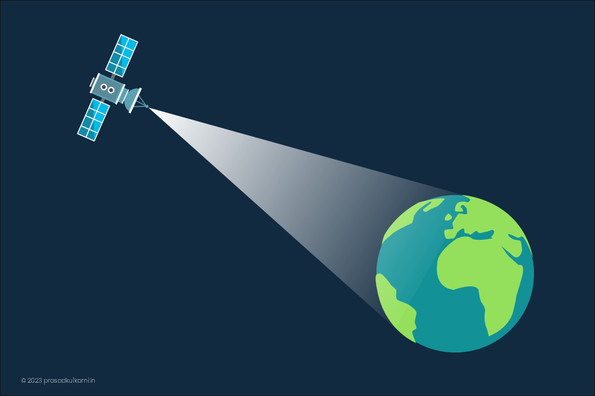
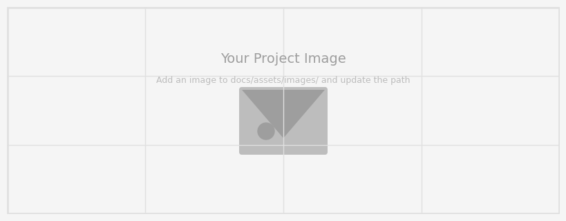

---
hide:
  - toc
  - navigation
---

# Blog

A selection of blog posts. Click any card to open the full article.

**[Sample Blog Post](sample-post.md)**

Remote Sensing is a tool for gathering information about objects at a distance. Humans and animals use their eyes to be sensing and collecting information about objects around close proximity. 

`Blog` `Geospatial` `Story`

[Read Post →](sample-post.md){ .md-button }

**[Sample Blog Post](sample-post.md)**

Remote Sensing is a tool for gathering information about objects at a distance. Humans and animals use their eyes to be sensing and collecting information about objects around close proximity. 

`Blog` `Geospatial` `Story`

[Read Post →](sample-post.md){ .md-button }

**[Sample Blog Post](sample-post.md)**

Remote Sensing is a tool for gathering information about objects at a distance. Humans and animals use their eyes to be sensing and collecting information about objects around close proximity. 

`Blog` `Geospatial` `Story`

[Read Post →](sample-post.md){ .md-button }

**[Sample Blog Post](sample-post.md)**

Remote Sensing is a tool for gathering information about objects at a distance. Humans and animals use their eyes to be sensing and collecting information about objects around close proximity. 

`Blog` `Geospatial` `Story`

[Read Post →](sample-post.md){ .md-button }

**[Sample Blog Post](sample-post.md)**

Remote Sensing is a tool for gathering information about objects at a distance. Humans and animals use their eyes to be sensing and collecting information about objects around close proximity. 

`Blog` `Geospatial` `Story`

[Read Post →](sample-post.md){ .md-button }

---

## How to add a new post

1. Create a new markdown file under `docs/blog/`, such as `my-first-post.md`.
2. Add the post to the blog index by copying one of the card blocks above and updating the title, image, and link.
3. Optionally update `mkdocs.yml` if you want the post to appear in the site navigation outside the blog index.
4. Preview the site with `mkdocs serve`.

