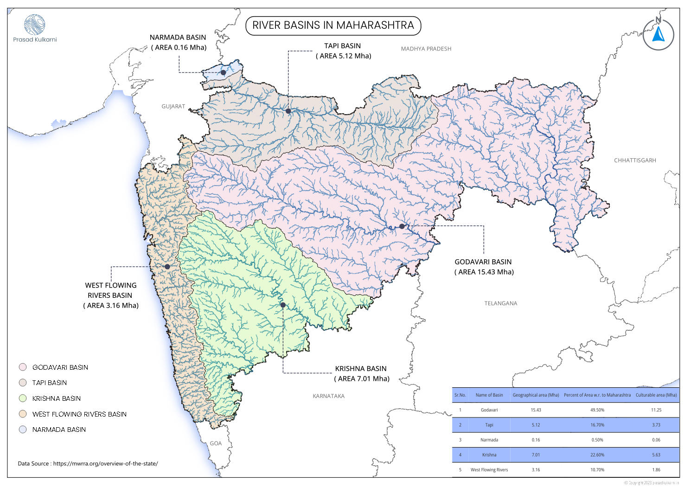
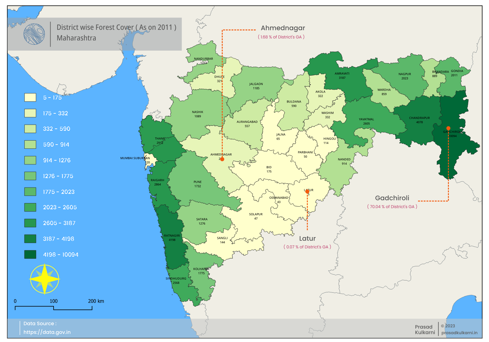
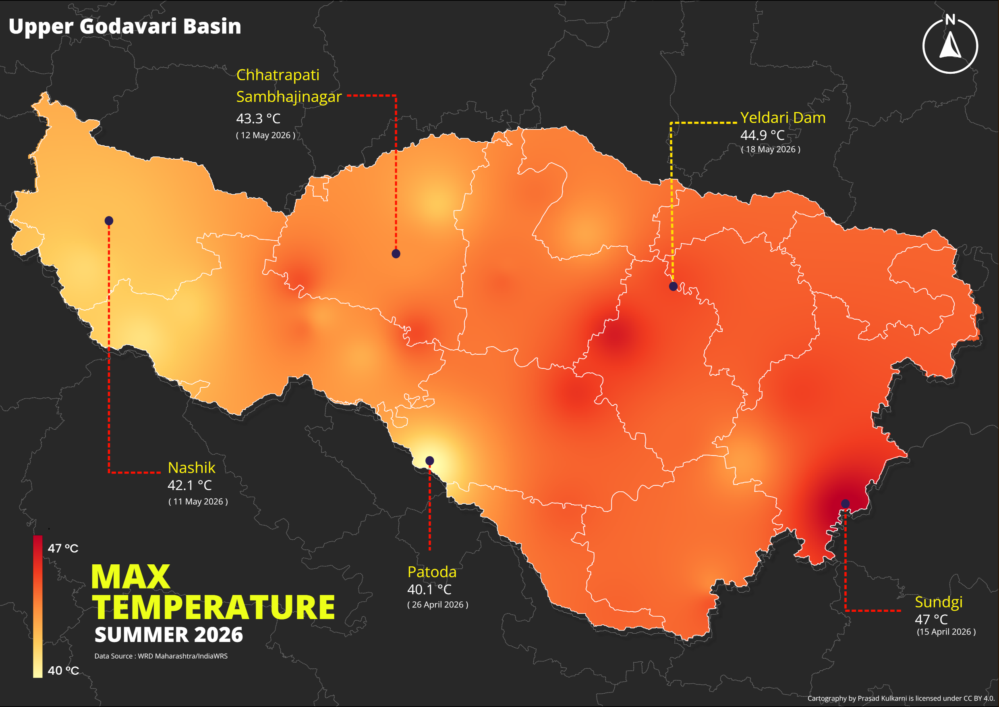
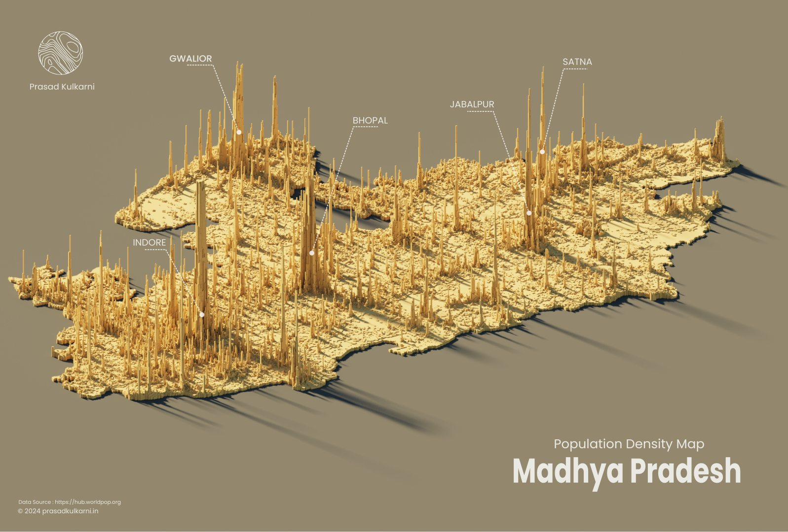
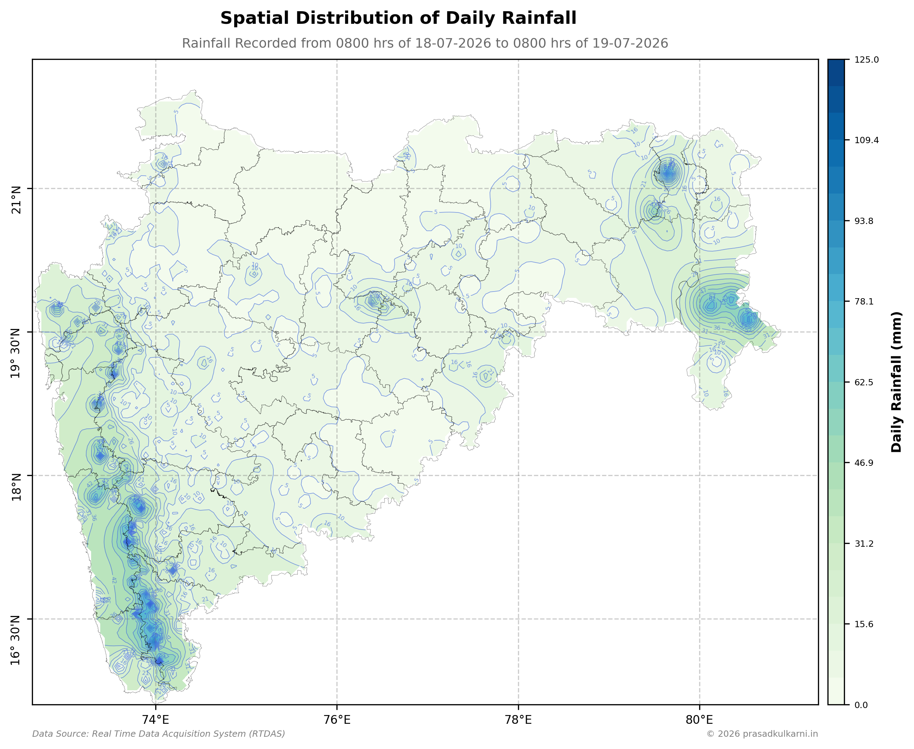

---
hide:
  - toc
---

# Cartography Gallery

A curated gallery of my cartographic work.

  

    
    

      <strong>Maharashtra River Basin</strong>
      
Hydrological basin with river network.

    

  

  

    
    

      <strong>Forest Cover Map</strong>
      
Forest cover and vegetation mapping with crisp map styling.

    

  

  

    
    

      <strong>Summer Temperature Map</strong>
      
Temperature distribution with a clear color palette.

    

  

  

    
    

      <strong>Population Density Map</strong>
      
Population Density Map of Madhya Pradesh (Census 2011)

    

  

  

    
    

      <strong>Spatial Distribution of Rainfall</strong>
      
Spatial distribution of daily rainfall with a clear color ramp.

    

  

  <a href="#" class="cartography-close">×</a>
  <a href="#lightbox-4" class="cartography-nav cartography-prev">‹ Prev</a>
  
  <a href="#lightbox-2" class="cartography-nav cartography-next">Next ›</a>

  <a href="#" class="cartography-close">×</a>
  <a href="#lightbox-1" class="cartography-nav cartography-prev">‹ Prev</a>
  
  <a href="#lightbox-3" class="cartography-nav cartography-next">Next ›</a>

  <a href="#" class="cartography-close">×</a>
  <a href="#lightbox-2" class="cartography-nav cartography-prev">‹ Prev</a>
  
  <a href="#lightbox-4" class="cartography-nav cartography-next">Next ›</a>

  <a href="#" class="cartography-close">×</a>
  <a href="#lightbox-3" class="cartography-nav cartography-prev">‹ Prev</a>
  
  <a href="#lightbox-5" class="cartography-nav cartography-next">Next ›</a>

  <a href="#" class="cartography-close">×</a>
  <a href="#lightbox-2" class="cartography-nav cartography-prev">‹ Prev</a>
  
  <a href="#lightbox-1" class="cartography-nav cartography-next">Next ›</a>

