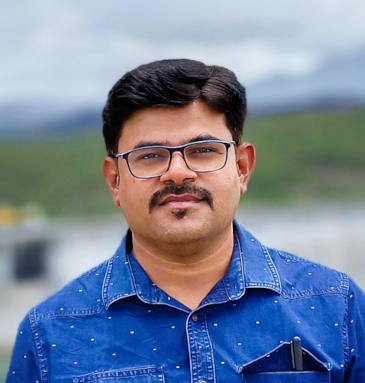
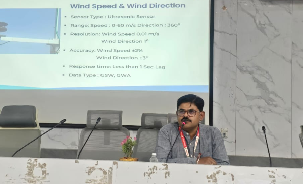

---
hide:
  - toc
  - navigation
---
<!--
CHECKLIST FOR THIS PAGE:
- [ ] Replace [YOUR NAME] with your full name (3 places)
- [ ] Replace [YOUR JOB TITLE] with your current or target role
- [ ] Replace [YOUR TAGLINE] with a short phrase describing your focus
- [ ] Rewrite the About Me paragraph with your own words
- [ ] Replace assets/images/profile.png with your actual photo (keep the filename or update it below)
- [ ] Replace assets/images/about.png with your own image (a field photo, map, or workspace shot)
- [ ] Edit the skill cards to match your actual skills (add, remove, or rename cards as needed)
- [ ] Update GitHub and LinkedIn links in the Connect section
- [ ] Add your CV PDF to docs/assets/ and update the filename in the Download CV button
-->

  

    
    <h1>Prasad Kulkarni</h1>
    
Cartographer | Spatial Analyst

    

      Rain • River • Reservoir
    

  

---

## About Me

Civil Engineer with over 14+ years of professional experience in the Water Resources sector spacially in Hydrology, working on Real Time Data Acquisition System, Surface Water Data monitoring and analysis, hydrological analysis, basin modelling, GIS-based spatial analysis, and flood forecasting systems. My work focuses on Hydro-Meteorological data collection, monitoring Real Time Data Acquisition System, and applying data-driven and technology-enabled solutions for effective water resource planning and management.

  I am currently working in the Water Resources Sector,  where I have been involved in planning, monitoring, and analysis of Real Time 
Data Acquisition System. My experience spans hydrology, meteorology, rainfall analysis, basin and sub-basin modelling, and development of decision support systems for flood management.

 

  

---

[View My Projects :material-arrow-right:](projects/index.md){ .md-button .md-button--primary }
<!-- [Download CV :material-download:](assets/[YOUR-NAME]-CV.pdf){ .md-button } -->

---

## Skills

-   :material-layers:{ .lg .middle } **GIS & Remote Sensing**

    ---

    - QGIS, Google Earth Engine
    - GDAL, GRASS GIS
    - Multispectral and SAR image analysis
    
-   :material-code-braces:{ .lg .middle } **Programming**

    ---

    - Python — GeoPandas, NumPy, Pandas, Matplotlib
    - JavaScript — Leaflet
    - SQL, MongoDB, PostgreSQL + PostGIS

<!-- -   :material-star-four-points:{ .lg .middle } **Machine Learning & GeoAI**

    ---

    - Supervised classification — Random Forest, XGBoost
    - Deep learning for image segmentation — U-Net, SAM
    - scikit-learn, PyTorch, TensorFlow
    - Object detection in satellite imagery -->

-   :material-earth:{ .lg .middle } **WebGIS & Data**

    ---

    - Leaflet.js, Folium, MapLibre JS
    - Cloud storage — Google Cloud Storage
    - Data formats — GeoTIFF, NetCDF, CSV
    - Streamlit for data-driven web apps

-   :material-database:{ .lg .middle } **Data & Cloud**

    ---

    - PostgreSQL + PostGIS
    - Cloud storage: Google Cloud Storage
    - Data formats: GeoJSON, GeoTIFF, NetCDF

-   :material-waves:{ .lg .middle } **Hydrological Analysis**

    - Hydrological Modelling (HEC-HMS)
    - Hydrodynamic Modelling(HEC-RAS)
  

-    :material-water-thermometer-outline:{ .lg .middle } **Data Acquisition System**

    - Real Time Data
    - Time Series Data Analysis
    - Statistical Analysis
    - DAQ System Management

---

## Connect

[GitHub](https://github.com/kulprasad2007){ .md-button }
[Facebook](https://facebook.com/kulprasad2007){ .md-button }
