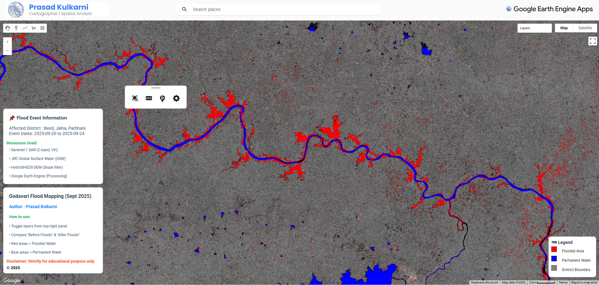
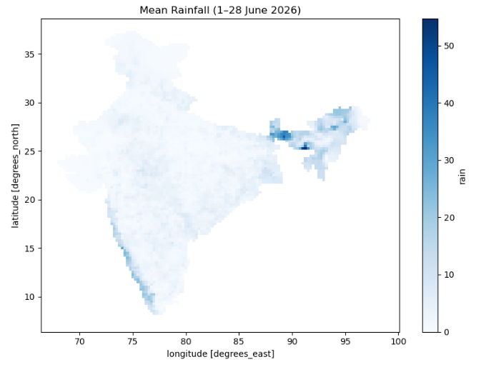

---
hide:
  - toc
  - navigation
---
<!--
CHECKLIST FOR THIS PAGE:
- [ ] Replace the two placeholder cards (marked [YOUR PROJECT ...]) with your real projects
- [ ] For each project: add a thumbnail image to docs/assets/images/ and update the path below
- [ ] For each project: create a project page by copying sample-project.md
- [ ] For each project: add a nav entry in mkdocs.yml (see the comments there)
- [ ] Delete placeholder cards you don't need yet
-->

# Projects

A selection of my geospatial projects. Click any card to see the full write-up.

**[Godavari Flood Mapping](godavari-flood.md)**

This project utilizes satellite remote sensing to map and analyze the severe flooding events in the Godavari River basin during 2025.

`GEE` `GEE User Interface (ui) API` `Sentinel-1 SAR`

[View Project →](godavari-flood.md){ .md-button }

**[IMD Daily Rainfall](Daily-Rainfall-From-IMD-Gridded-Data.ipynb)**

This project demonstrates how to download gridded rainfall observations from the India Meteorological Department (IMD) using the **imdlib** Python package.

`Python` `pandas` `imdlib`

[View Project →](Daily-Rainfall-From-IMD-Gridded-Data.ipynb){ .md-button }

